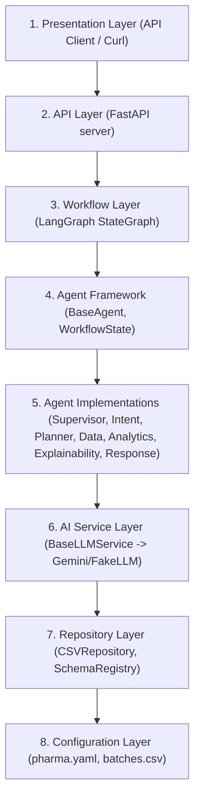

# UAXAI: Universal Agentic Explainable AI Platform

UAXAI is a configuration-driven, API-first, multi-agent explainable AI platform. This implementation is a v0.2 MVP demonstrating a routed multi-agent workflow for Pharmaceutical batch manufacturing analytics.

---

## 8-Layer Architecture



---

## Core Characteristics
1. **API-First**: Exposes capabilities and queries through clean FastAPI REST endpoints.
2. **Planner-Routed**: Replaces linear agent pipelines with a deterministic `PlannerAgent` that dynamically routes requests to the required nodes only.
3. **Configuration-Driven**: Industry capabilities, datasets, metrics, and filter allowances are declared in YAML configs (e.g. `config/industries/pharma.yaml`), enabling new industries to be added without code modifications.
4. **Structured Explainability**: Captures execution trace timestamps, agent outcomes, and mathematical evidence references securely without exposing prompts or raw datasets.

---

## Setup & Running Instructions

### 1. Installation
Create a virtual environment and install dependencies:
```powershell
python -m venv .venv
.\.venv\Scripts\Activate.ps1
python -m pip install -e ".[dev]"
```

### 2. Environment Configuration
Define your API key in a `.env` file (the API automatically falls back to a deterministic fake LLM service for testing if the key is missing):
```env
GEMINI_API_KEY=your-api-key-here
```

### 3. Launching the API
Start the FastAPI server:
```powershell
uvicorn api.main:app --reload
```
Interactive OpenAPI docs will be available at: `http://127.0.0.1:8000/docs`

### 4. Running the Test Suite
Execute the pytest suite:
```powershell
python -m pytest tests/test_configuration.py tests/test_repository.py tests/test_analytics.py tests/test_pharma_routing.py tests/test_api.py -q
```

---

## Demo API Request Example

Submit a batch yield query using curl:

```bash
curl -X POST http://127.0.0.1:8000/v1/queries \
  -H "Content-Type: application/json" \
  -d '{
    "query": "What is the average batch yield?",
    "industry": "pharma",
    "metric_id": "average_batch_yield",
    "filters": {"reactor_id": "Bioreactor Alpha"}
  }'
```

---

## Technical Documentation
For deeper architectural analysis and demo requests:
* **[ARCHITECTURE.md](file:///D:/My%20Projects/Universal%20Agentic%20Explainable%20AI%20(uaxAI)/uaxAI/docs/ARCHITECTURE.md)**: Component diagrams and workflow request sequences.
* **[DEMO_SCRIPT.md](file:///D:/My%20Projects/Universal%20Agentic%20Explainable%20AI%20(uaxAI)/uaxAI/docs/DEMO_SCRIPT.md)**: Three walkthrough scripts covering average yield, failed count, and unsupported request routing.
* **[LIMITATIONS.md](file:///D:/My%20Projects/Universal%20Agentic%20Explainable%20AI%20(uaxAI)/uaxAI/docs/LIMITATIONS.md)**: Deferrals and out-of-scope compliance.
