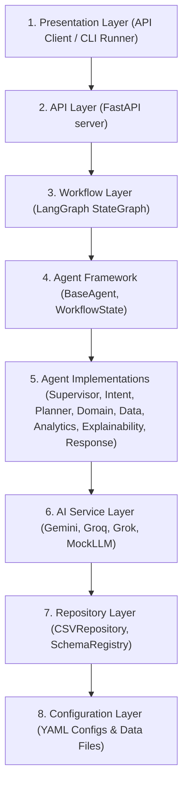

# UAXAI: Universal Agentic Explainable AI Platform

> [!WARNING]
> ### ⚠️ Deprecation & Evolution Notice
> **This repository (`uaxAI`) is now deprecated and archived.**
> 
> **UAXAI** served as the baseline foundation and proof-of-concept for multi-agent explainable AI routing, structured domain configuration, and mathematical evidence provenance. The architectural lessons and core principles established in this codebase have directly evolved into **CAPA Copilot** — an Explainable Multi-Agent Deviation Investigator for Pharma Quality Systems.
> 
> **CAPA Copilot** builds upon this foundation by integrating:
> * **Automated Cross-System Evidence Retrieval:** Pulling batch records, lab results, maintenance logs, and material lots automatically across **MES**, **LIMS**, **CMMS**, and **ERP**.
> * **Structured 6M Ishikawa Root Cause Analysis (RCA):** Systematically evaluating all six failure categories (Man, Machine, Method, Material, Measurement, Environment) to eliminate "human error" cop-outs.
> * **21 CFR Part 11 Compliant Evidence Traces:** Generating machine-readable `ExplainabilityTrace` schemas with human review and e-signature gates before QA sign-off.

**UAXAI** is a configuration-driven, API-first, multi-agent explainable AI platform. Designed to be fully industry-agnostic, this implementation focuses on the **pharmaceutical manufacturing and supply chain management (SCM)** vertical to streamline batch quality reviews, deviation evidence collection, and process audits.

---

## 1. What Problem This Project Is Trying to Solve

In regulated industrial environments—especially pharmaceutical batch manufacturing—decision-support tools face critical structural obstacles:

* **Time-Consuming Audit & Quality Reviews:** Manufacturing and quality teams spend days manually cross-referencing sensor logs, lab reports, CAPA records, and CSV documents to verify batch quality and investigate deviations.
* **Generative AI Hallucinations & Safety Risks:** Generic AI chatbots lack data provenance, invent numbers, and execute unverified actions, making them far too risky for regulated manufacturing environments (GxP, FDA 21 CFR Part 11).
* **Lack of Decision Tracing (Black-Box LLMs):** Traditional LLM applications run as black boxes, making it impossible for audit teams to track how a decision was reached or verify the exact underlying data path.
* **Rigid Software Pipelines:** Existing analytical software requires developer intervention and expensive backend code modifications to support new machine telemetry or database metrics.

---

## 2. How UAXAI Solves It

UAXAI bridges the gap between conversational AI and regulated compliance by introducing a governed, evidence-backed multi-agent framework:

1. **Configuration-Driven Flexibility:** All industry capabilities, metrics, allowed filters, and datasets are declared in plain-text YAML configuration files (e.g., `pharma_deviations.yaml`, `pharma_capas.yaml`). New metrics or datasets can be integrated without modifying core Python code.
2. **Deterministic Mathematical Execution:** LLMs never write executable code or query raw data directly. All calculations (sums, counts, averages) are executed deterministically by a dedicated `AnalyticsAgent` using validated Pydantic data models.
3. **Structured Explainability & Provenance:** Every response automatically generates an auditor-ready execution trace log, recording node execution durations, file paths used, and exact calculation metrics.
4. **Model-Agnostic LLM Layer:** Supports pluggable LLM backends including **Google Gemini**, **Groq (Llama 3.3 70B)**, **xAI (Grok)**, and a local deterministic **Mock LLM**.

---

## 3. Work Steps and Core Principles

### Core Design Principles
* **API-First & UI-Agnostic:** Built as a headless middleware engine. Exposes capabilities through clean FastAPI REST endpoints and a lightweight CLI runner.
* **Planner-Routed Efficiency:** Replaces rigid linear chains with a dynamic `PlannerAgent` that routes queries only to required nodes.
* **Mathematical Evidence Provenance:** Strict separation between deterministic computation (Python data pipeline) and natural language generation (LLM).
* **Auditor-Centric Transparency:** Captures full step-by-step state graphs for audit verification.

### Agent Workflow Execution Steps
The platform orchestrates **8 specialized cooperative agents** managed via a **LangGraph StateGraph**:

```
[Query Input] 
     │
     ▼
1. SupervisorAgent ────► Validates input security and industry context
     │
     ▼
2. IntentAgent ────────► Classifies query intent (ANALYZE, STATUS, DICTIONARY, etc.)
     │
     ▼
3. PlannerAgent ───────► Dynamically routes step-by-step execution path
     │
     ▼
4. DomainAgent ────────► Loads industry terminology & metric whitelists from YAML config
     │
     ▼
5. DataAgent ──────────► Fetches CSV records using Pydantic SchemaRegistry
     │
     ▼
6. AnalyticsAgent ─────► Executes deterministic mathematical calculation (sum, count, avg)
     │
     ▼
7. ExplainabilityAgent ─► Compiles audit trail (timing, source files, metric evidence)
     │
     ▼
8. ResponseAgent ──────► Synthesizes final answer combining data evidence with LLM
     │
     ▼
[Final Output + Audit Trace]
```

---

## 4. 8-Layer System Architecture



---

## 5. Setup & Installation

### Prerequisites
* Python 3.12+

### 1. Clone Repository & Create Virtual Environment
```powershell
# Clone the repository
git clone https://github.com/Starmann1/uaxAI.git
cd uaxAI

# Create virtual environment
python -m venv .venv
.\.venv\Scripts\Activate.ps1
```

### 2. Install Dependencies
```powershell
python -m pip install -e ".[dev]"
```

---

## 6. Environment Configuration

Create a `.env` file in the root directory (or use `.env.example` as a template). UAXAI supports multiple LLM providers out-of-the-box and automatically falls back to a local `MockLLMService` if no keys are provided:

```env
# Google Gemini API Key
GEMINI_API_KEY=your_gemini_api_key_here

# Groq API Key (Optional: for Llama 3.3 models)
GROQ_API_KEY=your_groq_api_key_here

# xAI Grok API Key (Optional: for Grok models)
XAI_API_KEY=your_xai_api_key_here
```

---

## 7. Running the Application

### Option A: Terminal CLI Runner (`query_cli.py`)
Run queries directly in your terminal using the helper CLI script:

```powershell
# 1. Deviations Dataset Query
python query_cli.py -i pharma_deviations -q "How many major deviations have been reported?"

# 2. CAPA Records Query
python query_cli.py -i pharma_capas -q "How many open CAPA records are there?"

# 3. Warehouse Locations Query (Using Groq / Llama 3)
python query_cli.py -i pharma_locations -q "What is the total warehouse capacity?" -p groq

# 4. Supplier Records Query
python query_cli.py -i pharma_suppliers -q "How many approved suppliers are registered?"
```

### Option B: FastAPI REST Server
Launch the headless REST API server:

```powershell
python -m uvicorn api.main:app --reload
```
* **Interactive OpenAPI Docs:** `http://127.0.0.1:8000/docs`

#### Sample REST API cURL Request:
```bash
curl -X POST http://127.0.0.1:8000/v1/queries \
  -H "Content-Type: application/json" \
  -d '{
    "query": "How many major deviations have been reported?",
    "industry": "pharma_deviations"
  }'
```

---

## 8. Running the Test Suite

Execute the full automated test suite (50 test cases):

```powershell
python -m pytest
```

---

## 9. Project Structure

```text
uaxAI/
├── config/                  # YAML industry configurations
│   └── industries/          # Industry configs (pharma_deviations, pharma_capas, etc.)
├── data/                    # CSV raw datasets (deviations, capas, suppliers, locations)
├── agents/                  # 8 cooperative agent implementations
├── graph/                   # LangGraph StateGraph & routing logic
├── models/                  # Pydantic data schemas & workflow states
├── repositories/            # Data loader & SchemaRegistry
├── services/                # LLM service abstraction (Gemini, Groq, Grok, Mock)
├── api/                     # FastAPI endpoints & dependency injection
├── ui/                      # Streamlit demonstration client (optional)
├── query_cli.py             # Command-line query runner
├── app.py                   # Local pipeline test execution
├── docs/                    # Architectural documents & diagrams
└── tests/                   # Pytest automated test suite (50 tests)
```

---

## 10. Technical Documentation

* **[ARCHITECTURE.md](docs/ARCHITECTURE.md):** Detailed component breakdown and sequence diagrams.
* **[DEMO_SCRIPT.md](docs/DEMO_SCRIPT.md):** Step-by-step walkthrough scripts for common queries.
* **[LIMITATIONS.md](docs/LIMITATIONS.md):** Scope boundaries and compliance deferrals.
