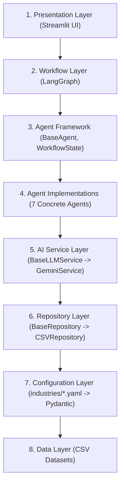

# UAIX Multi-Agent AI Platform

UAIX is a configuration-driven multi-agent AI platform built as a 2-hour Core Architecture Demonstration (CAD). It uses a linear StateGraph workflow to orchestrate cooperative agents that communicate exclusively via a shared, validated Pydantic workflow state.

---

## 8-Layer Non-Negotiable Architecture



---

## Architecture Breakdown

1. **Presentation Layer**: Streamlit web application dashboard (`ui/app.py`) providing dropdown switching between industries, text query submission, markdown response display, delta metric cards, and trace logs.
2. **Workflow Layer**: LangGraph StateGraph orchestration (`graph/workflow.py`) linking nodes linearly with one conditional edge to handle routing to a graceful failure termination node.
3. **Agent Framework**: Base model schemas (`models/workflow_state.py`, `models/agent_models.py`) and agent base classes (`agents/base_agent.py`) enforcing deep state copying and audit history tracing.
4. **Agent Implementations**: 7 cooperative, decoupled domain agents:
   * **SupervisorAgent**: Validates query presence.
   * **IntentAgent**: Classifies requests into 5 categories using keyword matching.
   * **DomainAgent**: Loads configurations to populate terminology keywords.
   * **DataAgent**: Invokes repositories to fetch target CSV dataset records.
   * **AnalyticsAgent**: Performs a single summation metric calculation.
   * **ExplainabilityAgent**: Summarizes execution history logs deterministically.
   * **ResponseAgent**: Connects to the LLM Service to assemble final responses.
5. **AI Service Layer**: Abstract service bindings (`services/base_llm_service.py`) and implementation (`services/gemini_service.py`) standardizing text generation calls.
6. **Repository Layer**: Abstract repository patterns (`repositories/base_repository.py`) and CSV parsing with Pydantic validation (`repositories/csv_repository.py`).
7. **Configuration Layer**: Industry-specific metadata rules (`config/industries/`) loaded dynamically into validation schemas (`models/config_models.py`).
8. **Data Layer**: Flat data stores (`data/automotive/production.csv` and `data/pharma/batches.csv`).

---

## Setup & Running Instructions

### 1. Installation
Install project dependencies:
```bash
pip install -e .
```

### 2. Environment Configuration
Define your Gemini API Key in a `.env` file at the project root:
```bash
GEMINI_API_KEY=your-api-key-here
```

### 3. Launching the Web UI
Run the Streamlit application:
```bash
streamlit run ui/app.py
```

### 4. Running the Test Suite
Execute the pytest suite:
```bash
python -m pytest tests/
```

---

## Deferred for the 2-hour Build
The following features are explicitly out-of-scope for this architectural validation demo:
* **Multi-turn Chat & History**: Conversation logs, memory retrieval, or thread databases.
* **Database Layer**: Production databases (PostgreSQL/MongoDB) or ORMs.
* **User Authentication**: Login screens, session tracking, authorization tokens, or OAuth keys.
* **Multi-operation Analytics**: Advanced statistical aggregations or charting.
* **Docker Containerization**: Dockerfile configurations, Docker Compose setups, or container runners.
* **FastAPI Server**: REST API endpoints or server routes.
