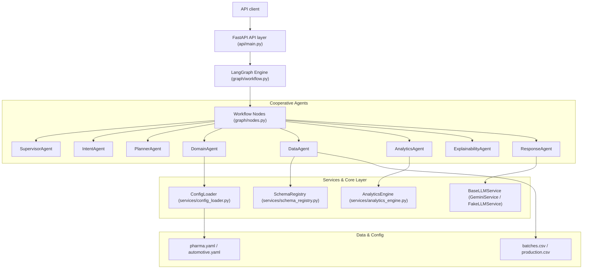
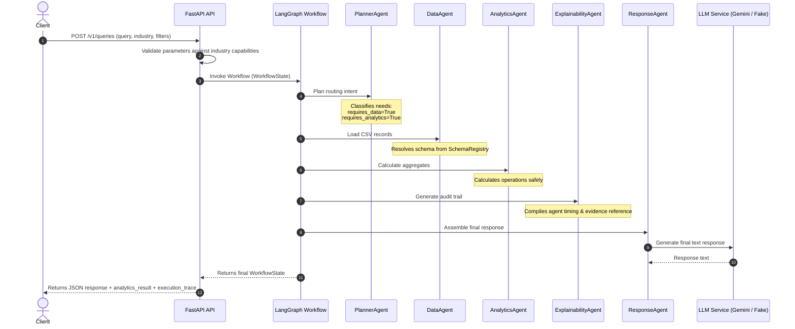

# UAXAI Architecture Documentation

## Core Overview

UAXAI is a configuration-driven, API-first, multi-agent explainable AI platform. It utilizes LangGraph for orchestrating specialized agents that execute state mutations on a shared, strongly-typed Pydantic state model (`WorkflowState`).

---

## Request Sequence Flow

The diagram below illustrates the path of a POST request to `/v1/queries` requiring batch data analytics.

